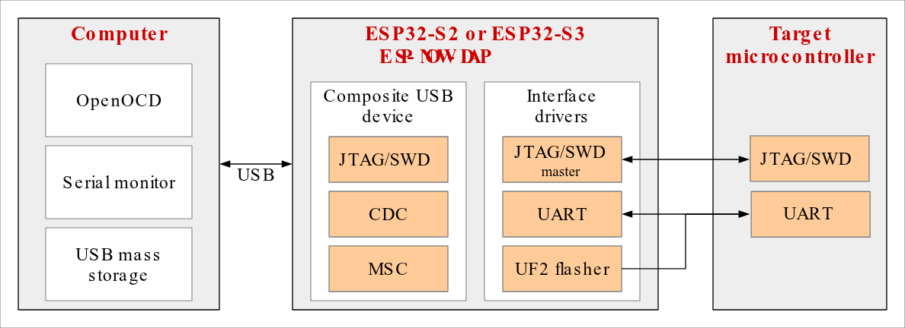

# ESP-NOW-DAP

ESP-NOW-DAP is an [ESP-IDF](https://github.com/espressif/esp-idf) project for ESP32-S2 and
ESP32-S3 that bridges a computer (PC) to a target microcontroller (MCU). Over USB it works
as a USB-to-UART replacement and a debugger; in the wireless roles the **same** serial and
SWD streams are tunnelled over **ESP-NOW**, so the PC no longer has to be physically
connected to the target. Both streams work at the same time.

This project is derived from Espressif's [ESP USB Bridge](https://github.com/espressif/esp-usb-bridge)
(EUB) — see [Origin and credits](#origin-and-credits).

The concept of the wired bridge is shown in the following figure.



ESP-NOW-DAP creates a composite USB device accessible from the PC when they are connected
through a USB cable. The main features are the following.

- *Serial bridge*: The developer can run [esptool](https://github.com/espressif/esptool) or connect a terminal program to the serial port provided by the USB CDC. The communication is transferred in both directions between the PC and the target MCU.
- *JTAG/SWD bridge*: [openocd-esp32](https://github.com/espressif/openocd-esp32) can be run on the PC, which will connect to ESP-NOW-DAP. The bridge MCU acts as a bridge between the PC and the MCU, and transfers JTAG/SWD communication between them in both directions.
- *Mass storage device*: A USB mass storage device is created which can be accessed by a file explorer on the PC. Binaries in UF2 format can be copied to this disk and the bridge MCU will use them to flash the target MCU. This is available in the wired role only.
- *Wireless bridge*: two boards can bridge the same serial and SWD traffic over ESP-NOW, so the PC does not have to be wired to the target. See [Wireless Bridge](#wireless-bridge).

## How to Compile the Project

[ESP-IDF](https://github.com/espressif/esp-idf) v5.0 or newer can be used to compile the project. Please read the
documentation of ESP-IDF for setting up the environment.

- `idf.py set-target` is used to select the chip the firmware is going to be built for. ESP32S2 and ESP32S3 are supported at the moment.
- `idf.py menuconfig` can be used to change the default configuration. The project-specific settings are in the "Bridge Configuration" sub-menu.
- `idf.py build` will build the project binaries.
- `idf.py -p PORT flash monitor` will flash the Bridge MCU and open the terminal program for monitoring. Please note that PORT is the serial port created by an USB-to-UART chip connected to the serial interface of the bridge MCU (not the direct USB interface provided by bridge MCU). This serial connection has to be established only for flashing. The bridge can work through the USB interface after that.

The initial flashing can be done by other means as well as it is pointed out in [this guide](https://docs.espressif.com/projects/esp-idf/en/latest/esp32s2/api-guides/usb-otg-console.html#uploading-the-application).

Board pins, flash size and USB identifiers live in `sdkconfig.defaults.esp32s3`, so a
plain `idf.py build` and every wireless role build start from the same hardware setup.

### Building the wireless roles

`Bridge Configuration -> Bridge role` selects which end of the bridge the firmware
implements. The wired role is the default, so a plain `idf.py build` still produces
the original single-board firmware.

**One role at a time** — pick the role in menuconfig and build normally:

```bash
idf.py set-target esp32s3
idf.py menuconfig      # Bridge Configuration -> Bridge role
idf.py build
```

**Several roles side by side** — give each role its own sdkconfig and build
directory, so switching roles never touches the other builds:

```bash
# wired
idf.py -B build_wired -D SDKCONFIG=sdkconfig.wired set-target esp32s3
idf.py -B build_wired -D SDKCONFIG=sdkconfig.wired build

# wireless host: sits next to the PC
idf.py -B build_host -D SDKCONFIG=sdkconfig.host \
       -D SDKCONFIG_DEFAULTS="sdkconfig.defaults;sdkconfig.defaults.wireless_host" set-target esp32s3
idf.py -B build_host -D SDKCONFIG=sdkconfig.host \
       -D SDKCONFIG_DEFAULTS="sdkconfig.defaults;sdkconfig.defaults.wireless_host" build

# wireless slave: sits next to the target
idf.py -B build_slave -D SDKCONFIG=sdkconfig.slave \
       -D SDKCONFIG_DEFAULTS="sdkconfig.defaults;sdkconfig.defaults.wireless_slave" set-target esp32s3
idf.py -B build_slave -D SDKCONFIG=sdkconfig.slave \
       -D SDKCONFIG_DEFAULTS="sdkconfig.defaults;sdkconfig.defaults.wireless_slave" build
```

Both wireless roles require the CMSIS-DAP SWD debug interface; the role default
files select it, and the build stops with an explicit error if it is missing.

## Origin and credits

This repository is a derivative work of **[ESP USB Bridge](https://github.com/espressif/esp-usb-bridge)**
by Espressif Systems.

Everything that makes the bridge work over USB comes from that project: the composite USB
device, the CDC serial bridge, the JTAG transport and the CMSIS-DAP SWD transport, the mass
storage / UF2 flasher, the DTR/RTS to BOOT/RST reset logic and the magic baud download mode.

What this repository adds is the wireless layer and the plumbing that makes a role switch
possible:

- `components/wireless_link/` — an ESP-NOW link with peer discovery and per-stream dispatch
- `main/bridge_glue.c` — the role dispatching glue between USB, the target UART/SWD pins and the link
- `docs/wireless.md` — the wireless design notes

Upstream copyright notices are retained unchanged in every file that came from EUB, and the
commit history that produced the original code is preserved in [CHANGELOG.md](CHANGELOG.md).

## Development Board

An ESP32-S2 or ESP32-S3 board is used as the bridge MCU, wired to the target MCU's UART,
debug and reset pins. The pin numbers can be changed in `idf.py menuconfig`; the defaults
used by this repository are collected in `sdkconfig.defaults.esp32s3`.

Please note that every board should have its own vendor and product identifiers. There is also a possibility to register a product identifier under the [Espressif vendor identifier](https://github.com/espressif/usb-pids).

## Serial Bridge

The USB stack creates a virtual serial port through which the serial port of the target MCU is accessible. For example, this port can be `/dev/ttyACMx` or `COMx` depending on the operating system and is different from the PORT used for flashing the bridge MCU.

For example, an ESP32 target MCU can be flashed and monitored with the following commands.

```bash
cd AN_ESP32_PROJECT
idf.py build
idf.py -p /dev/ttyACMx flash monitor
```

Please note that [esptool](https://github.com/espressif/esptool) or any terminal program can connect to the virtual serial port as well.

### Updating Bridge Firmware (Magic Baud Download Mode)

The bridge chip (ESP32-S2 or ESP32-S3) can reset **itself** into ROM download mode when the host sets the USB CDC port to a configured magic baud rate and then closes the port. This allows updating bridge firmware over the same USB cable without physical BOOT/RESET access.

The magic baud **arms** the reset; clearing DTR on port close **fires** it. The bridge then sets `RTC_CNTL_FORCE_DOWNLOAD_BOOT` and restarts. The ROM bootloader exposes a USB download interface on the same cable. This affects the **bridge MCU only**. While the bridge application is running, DTR/RTS on this port still drive the target's BOOT and RST lines; they are unrelated to this self-reset path except that clearing DTR is what fires it once armed.

Do **not** use the magic baud for normal target serial traffic. Opening the CDC at that rate and then clearing DTR (port close, or a host reset sequence that deasserts DTR) puts the **bridge** into download mode instead of communicating with the target.

Configure the magic baud in menuconfig under **Bridge Configuration** (`CONFIG_BRIDGE_DOWNLOAD_MAGIC_BAUD`, default `1200`). Set to `0` to disable. Prefer a baud that host tools will not use for the target. Rebuild and flash after changing the value. The host `bit_rate` must match exactly.

To trigger download mode from the host, adjust `PORT` and baud if configured differently.
DTR must be asserted while the magic baud is set, then cleared to fire the reset.
`pyserial` asserts DTR on open by default, so closing the port is enough:

```bash
python3 -c "import serial; s=serial.Serial('PORT', 1200); s.close()"
```

After the bridge reboots, flash over USB:

```bash
idf.py -p PORT flash
```

The feature requires `EFUSE_DIS_FORCE_DOWNLOAD` and `EFUSE_DIS_DOWNLOAD_MODE` not to be burned (default on development chips).

## JTAG Bridge

ESP-NOW-DAP provides a JTAG device. The following command can be used to connect to an ESP32 target MCU.

```bash
idf.py openocd --openocd-commands "-f board/esp32-bridge.cfg"
```

[Openocd-esp32](https://github.com/espressif/openocd-esp32) version v0.11.0-esp32-20211220 or newer can be used as well to achieve the same:

```bash
openocd -f board/esp32-bridge.cfg
```

Please note that the ESP usb bridge protocol has to be selected to communicate with the target MCU. `idf.py openocd` without additional arguments would establish connection with the bridge MCU (if the JTAG pins are connected through a USB-to-JTAG bridge to the PC).

The JTAG transport keeps the upstream protocol name, because it is the interface that
`openocd-esp32` matches on. Make your own copy of `esp_usb_bridge.cfg`, adjusting the
identifiers of your hardware if needed:

```
adapter driver esp_usb_jtag
espusbjtag vid_pid 0x303a 0x1002
espusbjtag caps_descriptor 0x030A  # string descriptor index:10
```

The JTAG interface might need some additional setup to work. Please consult the [documentation of ESP-IDF](https://docs.espressif.com/projects/esp-idf/en/latest/esp32/api-guides/jtag-debugging/configure-ft2232h-jtag.html) for achieving this.

## SWD Bridge

ESP-NOW-DAP also provides an ARM Serial Wire Debug (SWD) device using the CMSIS-DAP protocol.

On the OpenOCD side, CMSIS-DAP-related updates are continuously synced from the mainline to the Espressif fork. Therefore, it is always recommended to use the latest release or the latest master branch.

The following command can be used to access the SWD port on a target MCU

```bash
openocd -s tcl -f interface/cmsis-dap.cfg -f target/<target.cfg>.cfg -c 'adapter speed 5000'
```

Make sure to replace `target.cfg` with the actual target config file.

Currently, only USB-bulk transfers are supported as a backend. The HID backend is not supported.

## Mass Storage Device

A mass storage device will show up on the PC connected to the bridge. This can be accessed as any other USB storage disk. Binaries built in [the UF2 format](https://github.com/microsoft/uf2) can be copied to this disk and the bridge MCU will flash the target MCU accordingly.

This interface exists in the wired role only: the wireless roles have no local UART on the
host side to flash through, so flash the target with `esptool` over the tunneled serial port
instead.

Binary `uf2.bin` will be generated and placed into the `AN_ESP32_PROJECT/build` directory by running the following commands.

```bash
cd AN_ESP32_PROJECT
idf.py uf2
```

## Wireless Bridge

Two boards running this firmware can bridge the **same** serial and SWD traffic over
ESP-NOW, so the PC no longer has to be wired to the target. Serial and SWD work at
the same time.

```
 PC ──USB── ESP32-S3 "wireless host" ══ESP-NOW══ ESP32-S3 "wireless slave" ──UART+SWD── target MCU
```

- The **wireless host** plugs into the PC. Its USB CDC port and its CMSIS-DAP bulk
  interface are forwarded over the link.
- The **wireless slave** is wired to the target's UART, SWD (SWCLK/SWDIO) and
  BOOT/RST pins. It does not use its USB port at all.
- The two boards pair automatically and must be set to the same
  `Wireless Link Configuration -> Wi-Fi channel` (default 1). No button or binding
  procedure is involved.

`esptool`, `idf.py monitor` and OpenOCD are used exactly as in wired mode: the
CDC line coding and the DTR/RTS reset sequence are tunneled to the slave, so the
target can be flashed and debugged without changing anything on the PC side.

```bash
# SWD debugging through the host board
openocd -f interface/cmsis-dap.cfg -f target/esp32s3.cfg -c 'adapter speed 1000'

# serial, in parallel
idf.py -p /dev/ttyACMx monitor
```

Build instructions are in [How to Compile the Project](#building-the-wireless-roles);
the protocol, the SWD retransmission model, the pin configuration and the known
limitations are documented in [docs/wireless.md](docs/wireless.md).

## License

Licensed under the Apache License, Version 2.0 — see [LICENSE](LICENSE).

This project contains code from several origins, and every upstream notice is retained
as-is in the SPDX header of the file it belongs to:

- Portions originating from **ESP USB Bridge**: Copyright 2020-2026 Espressif Systems (Shanghai) Co Ltd.
- CMSIS-DAP sources under `components/debug_probe/DAP/`: Copyright (c) 2013-2022 ARM Limited.
- The wireless layer (`components/wireless_link/`, `main/bridge_glue.*`, `docs/wireless.md`)
  and other modifications made in this repository: Copyright 2026 Dbb.

## Contributing

Bug reports, feature requests and pull requests are welcome — please use this repository's
issue tracker.

Contributions in the form of pull requests should follow ESP-IDF project's [contribution guidelines](https://docs.espressif.com/projects/esp-idf/en/latest/esp32/contribute/index.html).

Additionally please install [pre-commit](https://pre-commit.com/#install) hooks before committing code:

```bash
pip install pre-commit
pre-commit install
```
